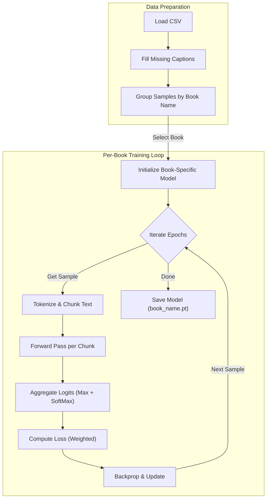

```mermaid
graph TD
    subgraph DataPrep ["Data Preparation"]
        A["Load CSV"] --> B["Fill Missing Captions"]
        B --> C["Group Samples by Book Name"]
    end

    subgraph Training ["Per-Book Training Loop"]
        C -->|Select Book| D["Initialize Book-Specific Model"]
        D --> E{"Iterate Epochs"}
        E -->|Get Sample| F["Tokenize & Chunk Text"]
        F --> G["Forward Pass per Chunk"]
        G --> H["Aggregate Logits (Max + SoftMax)"]
        H --> I["Compute Loss (Weighted)"]
        I --> J["Backprop & Update"]
        J -->|Next Sample| E
        E -->|Done| K["Save Model (book_name.pt)"]
    end
```
